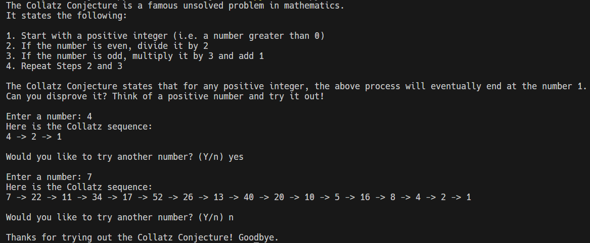

# Python Collatz Conjecture Project

This is a simple Python project that I made to test out the Collatz Conjecture. It takes user input and generates a sequence of numbers that always ends with 1.

The Collatz Conjecture states that for any positive integer, the following process will always end at 1:

1. If the number is even, divide it by 2
2. If the number is odd, multiply it by 3 and add 1
3. Repeat Steps 1 and 2

For more information, visit [this Wikipedia page on the Collatz Conjecture](https://en.wikipedia.org/wiki/Collatz_conjecture).

## Prerequisites

This project was made with Python 3.13.2 (the latest version as of March 2025). You can [download the latest version here](https://www.python.org/downloads/).

## Usage

First, fork and clone this project. Then, start the app by running the following commands in the command line:

1. `cd python-collatz-conjecture`
2. `python main.py`
    - (**Note:** If you're using Windows and you would rather not mess with adding Python to your PATH variable, you can run `py main.py` instead.)

Follow the prompts and have fun!

**Here is a typical usage example:**

## Testing

The tests for this project were created with the `unittest` library.

To run the tests, first make sure that you are in the `python-collatz-conjecture` directory. Then, run the following command: `python -m unittest tests.test_collatz`.

(**Note:** If you're using Windows and you would rather not mess with adding Python to your PATH variable, you can run `py -m unittest tests.test_collatz` instead.)

## License

This project is licensed under the [MIT License](LICENSE).